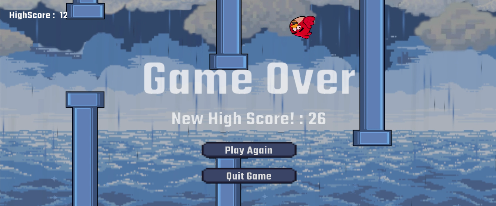

#  Flappy Bird Clone — 🐤

A Flappy Bird-style game built using Unity Engine as my first structured introduction to game development. The focus of this project was to:
- Apply experience with C# to development a game with full gameplay loop and replayabilty / score tracking.
- Learn Unity’s physics, animation, audio, and particle systems.
- Understand spawning, scrolling, and basic game state management.
- Implement Tap-to-flap physics-based movement using Unity’s Rigidbody2D.
- Apply Gravity-driven control tuned for responsive arcade feel.
- Use Collision triggers game over state.
- Introduction into 2D Sprite Art.

## Gameplay 
Clone and build this project in Unity to Play:

### Challenges
- Game feel tuning: Adjusted gravity and jump force for responsiveness.
- System timing: Moved effects to event-driven triggers for consistency.
- Performance awareness: Learned early concepts of reuse and cleanup.

### 🚀 If I revisited this project
- Add object pooling for better performance and cleaner spawning
- Improve difficulty progression over time
- Polish UI transitions and game states
- Add mobile/touch + controller support
- Refactor into a more formal state machine architecture
